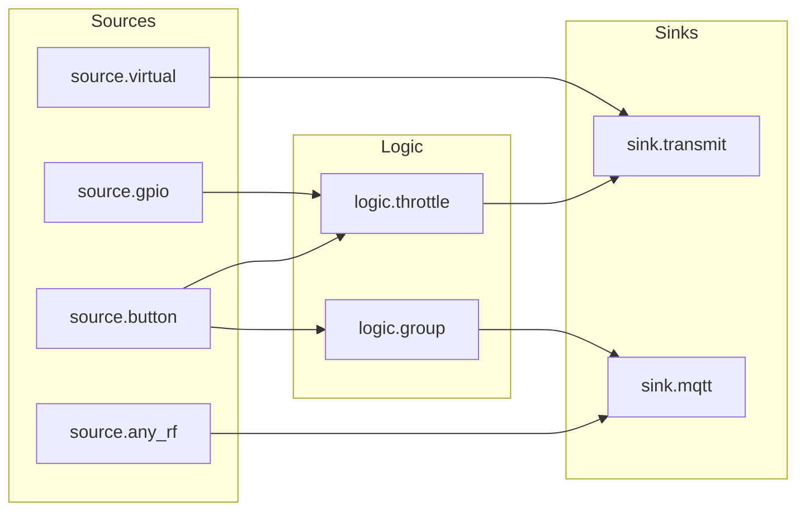

# Automations — the node graph
{: .no_toc }

Sources fire, logic shapes, sinks act. That is the whole model.
{: .fs-5 .fw-300 }

<details open markdown="block">
  <summary>On this page</summary>
  {: .text-delta }
- TOC
{:toc}
</details>

---

## The idea

Klingelbox does not have a list of "if this then that" rules. It has a small directed
graph of **nodes** connected by **links**. An event enters at a source, flows along the
links, and whatever sinks it reaches do something.



Three properties make this worth the extra concept over a rule list:

- **An event fans out.** One press can reach several sinks in one traversal — ring a chime
  *and* tell Home Assistant.
- **Logic composes.** A throttle in front of a group is a different thing from a group in
  front of a throttle, and both are things people actually want.
- **Sources are interchangeable.** Nothing downstream of a source knows or cares whether
  the event came from a radio burst, a wired button or an MQTT message.

Everything persists immediately. A doorbell that forgets its wiring on power loss is worse
than useless.

## Node types

There are eight, and they are all in `GET /api/graph`.

### Sources — things that start a chain

#### `source.button`
Fires when a **stored signal** is recognised on the air. This is the normal "someone
pressed my doorbell button" node: it carries `signal_id`, pointing at a signal you learned
or created.

#### `source.gpio`
Fires when a **wired button** on a GPIO is pressed. Configured entirely in the web UI:

| Field | Meaning |
|---|---|
| `gpio_pin` | The GPIO number. `-1` means unset. `GET /api/gpio/available` lists what you may pick. |
| `gpio_active_low` | `true` by default — a button to GND with the internal pull-up on. An unconnected pin then reads "not pressed" rather than floating. |
| `gpio_debounce_ms` | 50 ms by default. Mechanical buttons bounce; without this one press fires the chain several times. |

#### `source.virtual`
Fires from the web UI, from `POST /api/graph/nodes/{id}/fire`, or from MQTT. Give it a
`topic` and it is **subscribed** as `<base>/trigger/<topic>` — any message there fires it.
An empty `topic` means UI/REST triggering only.

This is how a doorbell chain becomes reachable from Home Assistant, Node-RED, or a shell
one-liner, with no radio involved at all.

#### `source.any_rf`
A **wildcard**: it fires on *every* received burst, including ones matching no stored
signal at all.

Wire one to a `sink.mqtt` and Home Assistant sees every press on the band — registered or
not. It is the "proxy everything" primitive, and it is also how you discover what is
actually out there before you learn anything.

{: .note }
> `source.any_rf` fires **in addition to** any matching `source.button`. A recognised
> burst legitimately drives both the specific chain and the wildcard chain in a single
> traversal. That is intended, not double-firing — but if you wire both to the same chime,
> it will ring twice.

### Logic — things that shape a chain

#### `logic.group`
Fires when the events linked into it satisfy `group_mode` within `window_s`:

- **`any`** — the first input through the window fires it. Use it to funnel several
  buttons into one action: *front door, back door and the garden gate all ring the
  upstairs chime.*
- **`all`** — every distinct input must fire within the window. Use it for deliberate
  combinations: *both buttons within 10 seconds means something specific.*

#### `logic.throttle`
A **leading-edge** throttle — a cooldown, or what Node-RED calls a rate limit.

> The first event passes through **immediately**. Everything within `window_s` after it is
> dropped.

That ordering is the entire point. A doorbell must ring on the *first* press and then go
quiet; the alternative (wait out the window, then act) would make a visitor stand there
while nothing happens.

With `window_s = 10`: the chime rings on the first press and stays silent for ten seconds
no matter how many times a child leans on the button.

It is source-agnostic: an RF remote, a wired GPIO button and an MQTT trigger are all
limited identically, because it limits whatever is linked into it rather than inspecting
where the event came from.

{: .note }
> **Time windows are in seconds** (`window_s`, 1–6000) — for `logic.group` and
> `logic.throttle` alike. The API also emits `window_ms` and still accepts it on write, but
> `window_s` wins when both are sent.

### Sinks — things that act

#### `sink.transmit`
Transmits a stored signal (`signal_id`) on 433 MHz. Carries its own `repeats` and `gap_us`,
defaulting to the global radio policy (6 repeats, 8000 µs apart).

**Repeats are not cosmetic.** Real receivers integrate several consistent copies of a frame
before they act, because the original remote transmits for as long as the button is held. A
single replay is routinely ignored.

#### `sink.mqtt`
Publishes to `<base>/<topic>` when it fires, carrying **what caused it** — signal id,
label, fingerprint, RSSI, repeat count and the decode, if any. See
[MQTT & Home Assistant](mqtt.html) for the payload.

For an unregistered burst arriving via `source.any_rf`, `signal_id` is `0` and `decoded`
may be `null`. That is the normal case behind a proxy, not an error.

---

## Signals: what a node points at

A **signal** is a stored waveform, not a decoded code. Three ways to get one:

| Origin | How |
|---|---|
| **Captured** | Learn mode. Press your remote; the box offers the burst for registration. |
| **Virtual** | `POST /api/signals/virtual` synthesises an EV1527 frame with a random or chosen address — a code the box invented, that you then teach *your* chime. |
| **Undecodable** | Also captured. If no decoder recognises it, it is stored as raw timings and works exactly like any other signal. |

### Learn mode

The receiver always listens; learn mode only decides whether an *unrecognised* burst is
offered to you for registration.

```sh
curl -X POST http://klingelbox.local/api/learn/arm -d '{"timeout_s":60}'
# press the remote, then:
curl http://klingelbox.local/api/learn
curl -X POST http://klingelbox.local/api/learn/accept -d '{"name":"Front door"}'
```

A candidate only appears when the burst repeated at least twice and scored at least 65 %
confidence. Those numbers come from bench measurement, not taste: real presses scored
67–92 %, ambient AGC noise 24–28 %.

### Virtual signals — pairing your own chimes

If you want a chime you own to ring, but you don't want it tied to a specific doorbell
remote, invent a signal:

```sh
curl -X POST http://klingelbox.local/api/signals/virtual \
     -d '{"name":"Upstairs chime","button":8,"base_us":350}'
```

Put the chime into its own pairing mode, test-fire the new signal from the UI, and the
chime learns *the box* as its remote. Now anything in your graph can ring it.

---

## Recipes

### One button, one chime
```
source.button ──▶ sink.transmit
```
The base case. Register the button, register (or invent) the chime signal, link them.

### Ring at most once every 10 seconds
```
source.button ──▶ logic.throttle (window_s: 10) ──▶ sink.transmit
```
Rings immediately on the first press, then ignores the button for ten seconds.

### Three buttons, one chime
```
source.button (front) ─┐
source.button (back)  ─┼─▶ logic.group (any) ──▶ sink.transmit
source.button (gate)  ─┘
```
No special node type needed: `logic.group` in `any` mode is the OR.

### Everything to Home Assistant, including unknown remotes
```
source.any_rf ──▶ sink.mqtt (topic: "doorbell")
```
Every burst on the band is published, registered or not. Combine with the retained
`<base>/unknown` topic to *see* the code of a remote before you learn it.

### A wired doorbell button that also rings the wireless chimes
```
source.gpio (pin 6) ──▶ logic.throttle ──▶ sink.transmit
                                       └──▶ sink.mqtt
```
The wired switch behaves exactly like an RF button. Nothing downstream knows the
difference.

### Home Assistant rings the chime
```
source.virtual (topic: "chime") ──▶ sink.transmit
```
```sh
mosquitto_pub -t klingelbox/trigger/chime -m ''
```
Any message on that topic fires the node. Payload content is irrelevant.

---

## Limits and guard rails

| Limit | Value | Why |
|---|---|---|
| Nodes per graph | 24 | Comfortably more than a house needs; keeps traversal bounded. |
| Traversal depth | 8 | Bounds the blast radius of a mis-wired graph — a cycle cannot run away. |
| Node name | 32 characters | |
| Topic suffix | 48 characters | |
| Window | 1–6000 seconds | |

Every node has an `enabled` flag. Turning a node off is the right way to test a hypothesis
about a misbehaving graph — deleting it also deletes its links.

## Editing the graph

Everything above is exposed over REST, so the web UI and any script you write see the same
surface:

| Endpoint | Does |
|---|---|
| `GET /api/graph` | The whole graph — nodes and links. |
| `POST /api/graph/nodes` | Create a node (a node object without `id`). |
| `POST /api/graph/nodes/{id}` | Partial update. |
| `DELETE /api/graph/nodes/{id}` | Delete it, and its links. |
| `POST /api/graph/nodes/{id}/fire` | Test-fire — also how you trigger a `source.virtual`. |
| `POST /api/graph/links` | `{"from":1,"to":2}` |
| `DELETE /api/graph/links` | `{"from":1,"to":2}` |

Full details, including every field on a node object, are in the
[REST API reference](https://github.com/MarvAmBass/klingelbox/blob/main/docs/API.md).

`GET /api/events` is the debugging tool when a chain does not do what you expect: it shows
what fired, in order, with the reason — `rf_unmatched`, `button_press`, `wired_press`,
`node_fired`, `transmit`, `learn`, `system`.
