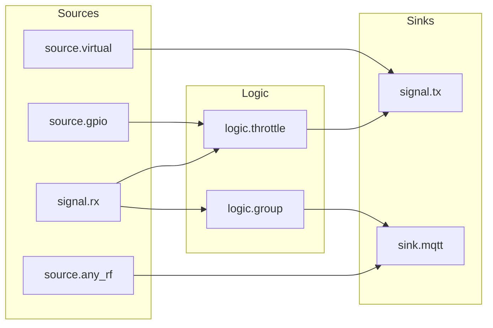

# Automations — the node graph
{: .no_toc }

Sources fire, logic shapes, sinks act. That is the whole model.
{: .fs-5 .fw-300 }

<details open markdown="block">
  <summary>On this page</summary>
  {: .text-delta }
- TOC
{:toc}
</details>

---

## The idea

Klingelbox does not have a list of "if this then that" rules. It has a small directed
graph of **nodes** connected by **links**. An event enters at a source, flows along the
links, and whatever sinks it reaches do something.



Three properties make this worth the extra concept over a rule list:

- **An event fans out.** One press can reach several sinks in one traversal — ring a chime
  *and* tell Home Assistant.
- **Logic composes.** A throttle in front of a group is a different thing from a group in
  front of a throttle, and both are things people actually want.
- **Sources are interchangeable.** Nothing downstream of a source knows or cares whether
  the event came from a radio burst, a wired button or an MQTT message.

Everything persists immediately. A doorbell that forgets its wiring on power loss is worse
than useless.

## Node types

There are eleven, and they are all in `GET /api/graph`.

### Sources — things that start a chain

#### `signal.rx` — Signal receiver
Fires when a **stored signal** is recognised on the air. This is the normal "someone
pressed my doorbell button" node: it carries `signal_id`, pointing at a signal you learned
or created.

**Output only. It never transmits**, on any path — not when a burst matches it, not when
you fire it by hand. Firing it (`POST /api/graph/nodes/{id}/fire`, or ▶ on the map) means
*"pretend this code was just heard"*: the output fires, the chain after it runs, and
nothing goes on air. Sending a code is [`signal.tx`](#signaltx--signal-sender)'s job.

#### `source.gpio`
Fires when a **wired button** on a GPIO is pressed. Configured entirely in the web UI:

| Field | Meaning |
|---|---|
| `gpio_pin` | The GPIO number. `-1` means unset. `GET /api/gpio/available` lists what you may pick. |
| `gpio_active_low` | `true` by default — a button to GND with the internal pull-up on. An unconnected pin then reads "not pressed" rather than floating. |
| `gpio_debounce_ms` | 50 ms by default. Mechanical buttons bounce; without this one press fires the chain several times. |

#### `source.virtual` — MQTT button
**A button Home Assistant can press.** With MQTT discovery on it appears in your dashboard
by itself — no YAML, no automation — and pressing it starts whatever is wired after it.
The same button answers to any MQTT client, to ▶ in the web UI, and to
`POST /api/graph/nodes/{id}/fire`.

It is **subscribed** as `<base>/trigger/<topic>`, and *any* message there fires it: the
payload is never inspected, so `mosquitto_pub -n` is a press. An empty `topic` does **not**
mean "no MQTT" — it falls back to a slug of the node's `name`, so a button called
"Ring the chime" answers on `ring_the_chime` with nothing typed. Use `mqtt_enabled: false`
to keep one off the broker.

Several of these may share one topic on purpose: one message fires **all** of them, which
is how a single "ring everything" button drives several chains with no special node type.

{: .note }
> It is called `source.virtual` on the wire and in the API, and "Virtual trigger" in the UI
> up to 0.5 — which is why people kept asking for an MQTT-triggerable button that had been
> on the palette all along. The wire name is on flash and does not change.

#### `source.any_rf`
A **wildcard**: it fires on *every* received burst, including ones matching no stored
signal at all.

Wire one to a `sink.mqtt` and Home Assistant sees every press on the band — registered or
not. It is the "proxy everything" primitive, and it is also how you discover what is
actually out there before you learn anything.

{: .note }
> `source.any_rf` fires **in addition to** any matching `signal.rx`. A recognised
> burst legitimately drives both the specific chain and the wildcard chain in a single
> traversal. That is intended, not double-firing — but if you wire both to the same chime,
> it will ring twice.

### Logic — things that shape a chain

#### `logic.group`
Two modes that do genuinely different things. They share a node type because they share a
shape — several links in, one out — not because they are variations on one rule, and only
one of them uses `window_s`.

**`any` — a merge point.** Anything arriving is passed straight on, immediately. It does
not wait, does not compare inputs and **never looks at the window at all**. What it buys
is structural rather than logical: several sources meet at one node, so the chain hanging
off it exists in exactly one place. *Front door, back door and the garden gate all ring
the upstairs chime* — and when you want to add a rate limit to all three, you add it once.

**`all` — a coincidence detector.** Nothing passes until **every** inbound link has
carried an event inside `window_s`. When that happens it fires once, forgets all of them
and re-arms, so it will not fire again on the next event from any single input. *Both
buttons within 10 seconds means something specific.* The window is what makes "all of
them" usable at all — nobody presses two buttons in the same instant. An `all` group with
no inbound links can never be satisfied and never fires.

{: .note }
> `window_s` applies to **`all` only**. Sending one with `group_mode: "any"` is accepted
> and stored, but changes nothing — the web UI hides the field in that mode for exactly
> that reason.

#### `logic.throttle`
A **leading-edge** throttle — a cooldown, or what Node-RED calls a rate limit.

> The first event passes through **immediately**. Everything within `window_s` after it is
> dropped.

That ordering is the entire point. A doorbell must ring on the *first* press and then go
quiet; the alternative (wait out the window, then act) would make a visitor stand there
while nothing happens.

With `window_s = 10`: the chime rings on the first press and stays silent for ten seconds
no matter how many times a child leans on the button.

It is source-agnostic: an RF remote, a wired GPIO button and an MQTT trigger are all
limited identically, because it limits whatever is linked into it rather than inspecting
where the event came from.

{: .note }
> **Time windows are in seconds** (`window_s`, 1–6000) — for `logic.group` and
> `logic.throttle` alike. The API also emits `window_ms` and still accepts it on write, but
> `window_s` wins when both are sent.

#### `logic.switch`
A **switch in the wire**. Every other node type is a source, a transform or a sink; this
one sits *in* a link and decides whether it conducts.

> **ON** — events pass through untouched.
> **OFF** — nothing gets past it. Everything wired after it is dead until it is switched
> back on.

That is the node that makes *"turn the inside bell off tonight"* a toggle. Before it, the
only way to stop a path was to delete the link — destructive, easy to forget to put back,
and impossible to automate.

**Three equivalent ways to move it**, and they are genuinely the same switch:

| from | how |
|---|---|
| the web UI | the ON/OFF button on the node's card, in its editor, or the **I / O** badge on the map |
| the REST API | `POST /api/graph/nodes/{id}/switch` `{"on":false}` |
| MQTT | publish to `<base>/switch/<topic>/set` |

Give it a `topic` and it appears in Home Assistant as a native **`switch` entity** on the
Klingelbox device: a real toggle in the dashboard, usable in automations like any other
switch. The set topic accepts `ON` / `OFF` / `1` / `0` / `true` / `false` in any case, and
`{"state":"ON"}` for good measure. The box answers on `<base>/switch/<topic>/state`,
**retained**, on every change and on every connect — so the toggle is right after a Home
Assistant restart, after a broker restart, and after the box itself reboots.

```sh
mosquitto_pub -t klingelbox/switch/outside_bell/set -m OFF
mosquitto_sub -t klingelbox/switch/outside_bell/state   # -> OFF
```

**Several switch nodes may share one topic.** That is the point, not a clash: one Home
Assistant toggle then gates every one of them at once, the way a single wall switch feeds
several lamps. A `set` moves them all; the reported state is `ON` if any of them is
conducting. Home Assistant sees one entity per *topic*, not one per node.

Leave the topic empty and the switch still works perfectly — from the UI and the REST API.
Nothing subscribes to it and no entity appears.

{: .note }
> A switch's position **is** the node's `enabled` flag, so `GET /api/graph` reports it
> there. Prefer the `/switch` route over a plain node update for anything automated: it
> takes effect immediately but does not rewrite the graph blob on every toggle, which is
> what keeps an automation flapping a switch from wearing the flash out. The box comes back
> from a reboot in the last settled position and republishes it retained, so nothing is ever
> shown a position the box is not in.

### Sinks — things that act

#### `signal.tx` — Signal sender
Transmits a stored signal (`signal_id`) on 433 MHz whenever something reaches it. Carries
its own `repeats` and `gap_us`, defaulting to the global radio policy (6 repeats, 8000 µs
apart).

**Input only. It never listens.** Hearing its own code on air does not start it — that is
what stops the box echoing back everything it hears, structurally rather than by a special
case. Firing it by hand transmits, exactly as an inbound link would.

**Repeats are not cosmetic.** Real receivers integrate several consistent copies of a frame
before they act, because the original remote transmits for as long as the button is held. A
single replay is routinely ignored.

{: .note }
> `signal.rx` and `signal.tx` draw on the **same pool of stored signals**, so a code you
> both listen for and send is two nodes pointing at one `signal_id`. That is the point:
> each node does one thing, the ports show which way events travel, and a relay reads
> plainly as `signal.rx (A) → … → signal.tx (B)`.

#### `sink.mqtt`
Publishes to `<base>/<topic>` when it fires, carrying **what caused it** — signal id,
label, fingerprint, RSSI, repeat count and the decode, if any. See
[MQTT & Home Assistant](mqtt.html) for the payload.

For an unregistered burst arriving via `source.any_rf`, `signal_id` is `0` and `decoded`
may be `null`. That is the normal case behind a proxy, not an error.

#### `sink.monitor`
A sink that **acts on nothing**. Reaching it records a timestamp — no transmit, no publish,
no pin — and the web UI turns that into a lamp that lights on every hit plus a rolling
ten-minute timeline. It is the debugging tool for the graph itself: drop one beside a
`signal.tx` and you can prove a chain fires without ringing anything in the house.

`window_s` (1–60 s, default 3) is how long the indicator stays lit per hit. The hits live in
RAM only, capped at 64 per node and pruned to a 600 s window, and are read back from
`GET /api/monitor`. Nothing is written to flash and nothing survives a reboot.

Paired with a `source.virtual`, whose ▶ button fires it from the node card, the editor or
straight off the canvas, it makes any chain verifiable with no transmitter and nothing
audible:

```
source.virtual ──▶ (whatever you are testing) ──▶ sink.monitor
```

---

## Signals: what a node points at

A **signal** is a stored waveform, not a decoded code. Three ways to get one:

| Origin | How |
|---|---|
| **Captured** | A listening session. Press your remote a few times; the box ranks what it heard and you keep the one that rings your bell. |
| **Virtual** | `POST /api/signals/virtual` synthesises an EV1527 frame with a random or chosen address — a code the box invented, that you then teach *your* chime. |
| **Undecodable** | Also captured. If no decoder recognises it, it is stored as raw timings and works exactly like any other signal. |

### Listening sessions

The receiver always listens; a *session* only decides whether an unrecognised burst is
kept and offered to you. **There is no `/api/learn` any more** — it required two repeats
*and* 65 % normalization confidence before it would show you anything, and both numbers
were measured on EV1527 remotes. That made it a mode for one protocol family: a remote of
any other shape produced no candidate at all, and no explanation either.

Detection is now permissive and protocol-agnostic — everything the radio hands up is
kept — and the box **ranks** instead of filtering:

```sh
curl -X POST http://klingelbox.local/api/raw/start -d '{"seconds":30}'
# press the remote several times, then:
curl http://klingelbox.local/api/raw/candidates
# try the top one at the bell, without storing anything:
curl -X POST http://klingelbox.local/api/raw/candidates/1/transmit -d '{}'
# keep it:
curl -X POST http://klingelbox.local/api/raw/candidates/1/save -d '{"name":"Front door"}'
```

**Repetition dominates the ranking.** A real remote sends the same word several times and
band noise never does, so "seen 5 times" is the strongest evidence of authenticity
available — and collecting it needs no knowledge of any protocol. A decoded protocol and a
high confidence raise a candidate further, but only ever as a tie-break: an undecoded
candidate can rank first and is fully usable. Each one carries a `why` string
(`"seen 5 times, decoded ev1527, 92% confidence"`) so the ranking is checkable rather than
magic.

If one press arrives as several dissimilar pieces, the frame boundary fired mid-
transmission. The session reports that in `fragmentation`, suggests a longer `idle_us`
derived from the widest gap it actually measured, and — where the pieces fit back
together — offers the rejoined whole as a `merged` candidate, stitched with the measured
silence rather than a guessed one. See [the API reference](API.html#listening--raw-sessions).

### Virtual signals — pairing your own chimes

If you want a chime you own to ring, but you don't want it tied to a specific doorbell
remote, invent a signal:

```sh
curl -X POST http://klingelbox.local/api/signals/virtual \
     -d '{"name":"Upstairs chime","button":8,"base_us":350}'
```

Put the chime into its own pairing mode, test-fire the new signal from the UI, and the
chime learns *the box* as its remote. Now anything in your graph can ring it.

---

## Recipes

### One button, one chime
```
signal.rx (front door) ──▶ signal.tx (chime)
```
The base case, and the shape everything else is built from: a receiver for the code you
hear, a sender for the code you want to go out. Register the button, register (or invent)
the chime signal, link them.

### Ring at most once every 10 seconds
```
signal.rx (front door) ──▶ logic.throttle (window_s: 10) ──▶ signal.tx (chime)
```
Rings immediately on the first press, then ignores the button for ten seconds.

### Three buttons, one chime
```
signal.rx (front) ─┐
signal.rx (back)  ─┼─▶ logic.group (any) ──▶ signal.tx (chime)
signal.rx (gate)  ─┘
```
No special node type needed. `logic.group` in `any` mode is a merge point — each receiver
is passed straight through — so the single chain after it is written once.

### Both buttons, together
```
signal.rx (front) ─┬─▶ logic.group (all, window_s: 10) ──▶ signal.tx (chime)
signal.rx (back)  ─┘
```
The same node in its other mode, and the only one where `window_s` does anything: nothing
passes until *both* receivers have fired within ten seconds of each other.

### Outside bell on, inside bell off — from Home Assistant
```
                           ┌─▶ logic.switch "Outside bell" ──▶ signal.tx (outside chime)
signal.rx (front door) ────┤     topic: outside_bell
                           └─▶ logic.switch "Inside bell"  ──▶ signal.tx (inside chime)
                                 topic: inside_bell
```
One press fans out to both branches, and each branch has its own switch in it. Two toggles
appear in Home Assistant. Turn *Inside bell* off and the outside chime still rings while
the inside one stays silent — on the map its wire is drawn broken, so you can see which
path is dead. Nothing is deleted and nothing has to be re-wired to put it back.

```sh
mosquitto_pub -t klingelbox/switch/inside_bell/set -m OFF   # quiet indoors
mosquitto_pub -t klingelbox/switch/inside_bell/set -m ON    # back to normal
```

Give both switches the **same** topic instead and they become one toggle that silences the
whole doorbell — a "do not disturb" switch, with no extra node type.

### Relay a code you hear as a different code
```
signal.rx (neighbour's remote) ──▶ logic.throttle ──▶ signal.tx (your chime)
```
Two nodes, so the chain reads left to right and anything can be put in the middle. This is
the shape that used to be awkward: when one node stood for a code in *both* directions, a
relay meant wiring a node into itself and reasoning about which of its two jobs it would
do. Now the ports say it.

The same `signal_id` on both ends is legal too. The radio ignores what the box itself just
transmitted for about a second afterwards, so a sender does not feed its own receiver and
go round again.

### Everything to Home Assistant, including unknown remotes
```
source.any_rf ──▶ sink.mqtt (topic: "doorbell")
```
Every burst on the band is published, registered or not. Combine with the retained
`<base>/unknown` topic to *see* the code of a remote before you register it.

### A wired doorbell button that also rings the wireless chimes
```
source.gpio (pin 6) ──▶ logic.throttle ──▶ signal.tx (chime)
                                       └──▶ sink.mqtt
```
The wired switch behaves exactly like an RF button. Nothing downstream knows the
difference.

### Press a button in Home Assistant, ring the chime
```
source.virtual "Ring the chime" ──▶ signal.tx (chime)
```
Two nodes, and nothing else to fill in. With discovery on, a **button** entity for it
appears on the Klingelbox device in Home Assistant by itself; pressing it puts the chime's
code on air. The topic follows the node's name unless you type one, so this button answers
on `klingelbox/trigger/ring_the_chime`:
```sh
mosquitto_pub -t klingelbox/trigger/ring_the_chime -m ''
```
Any message on that topic fires the node. Payload content is irrelevant — arriving *is*
the press. Point a second `source.virtual` at the same topic and one press fires both
chains.

---

## Limits and guard rails

| Limit | Value | Why |
|---|---|---|
| Nodes per graph | 24 | Comfortably more than a house needs; keeps traversal bounded. |
| Traversal depth | 8 | Bounds the blast radius of a mis-wired graph — a cycle cannot run away. |
| Node name | 32 characters | |
| Topic suffix | 48 characters | |
| Window | 1–6000 seconds | |

Every node has an `enabled` flag. Turning a node off is the right way to test a hypothesis
about a misbehaving graph — deleting it also deletes its links.

## Editing the graph

Everything above is exposed over REST, so the web UI and any script you write see the same
surface:

| Endpoint | Does |
|---|---|
| `GET /api/graph` | The whole graph — nodes and links. |
| `POST /api/graph/nodes` | Create a node (a node object without `id`). |
| `POST /api/graph/nodes/{id}` | Partial update. |
| `DELETE /api/graph/nodes/{id}` | Delete it, and its links. |
| `POST /api/graph/nodes/{id}/fire` | Test-fire — also how you trigger a `source.virtual`. |
| `POST /api/graph/links` | `{"from":1,"to":2}` |
| `DELETE /api/graph/links` | `{"from":1,"to":2}` |

Full details, including every field on a node object, are in the
[REST API reference](https://github.com/MarvAmBass/klingelbox/blob/main/docs/API.md).

`GET /api/events` is the debugging tool when a chain does not do what you expect: it shows
what fired, in order, with the reason — `rf_unmatched`, `button_press`, `wired_press`,
`node_fired`, `transmit`, `learn`, `system`.
