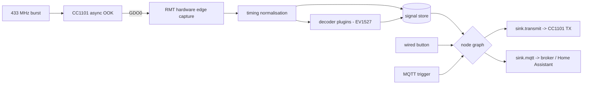

# Klingelbox
{: .no_toc }

**Die Klingel, lokal und ohne Cloud.**
{: .fs-6 .fw-300 }

A 433 MHz receive / analyse / replay appliance on an ESP32-S3. It listens to your
doorbell, learns its buttons, replays them, and routes every press wherever you want —
another chime, Home Assistant, or both. Nothing leaves your network.
{: .fs-5 .fw-300 }

[Flash it in your browser](flasher/){: .btn .btn-primary .mr-2 }
[Hardware](hardware.html){: .btn .mr-2 }
[View on GitHub](https://github.com/MarvAmBass/klingelbox){: .btn }

---

## What it is

*Klingel* is German for doorbell. A Klingelbox is a small box that sits between your
existing 433 MHz doorbell hardware and the rest of your house.

It is built around a wireless doorbell, but it is deliberately **not** a doorbell hack.
The radio layer is protocol-agnostic: the CC1101 hands raw pulse edges to the ESP32-S3's
RMT peripheral, which timestamps them **in hardware**, and everything above that works on
raw timings. Decoding (EV1527 today) is one optional plugin on top.

The practical consequence is the thing most 433 MHz projects cannot do:

> **A signal nobody can decode is still a first-class citizen.** It can be stored, named,
> matched and replayed exactly like a recognised one, because what was recorded is the
> waveform, not a guess about its meaning.

## What you can do with it

- **Register your doorbell buttons** in a learn mode that ignores noise (a real press and
  the receiver's own AGC noise are ~50 dB apart in signal strength — the box uses that,
  not pulse counts, to tell them apart).
- **Replay** any stored signal on demand, from the web UI, the REST API, or a node graph.
- **Synthesise virtual signals** so you can pair your own chimes to a code the box
  invented, instead of hunting for the remote's.
- **Wire it all together** in a [node graph](automations.html): *this button rings those
  chimes, these three all ring the upstairs one, and don't ring more than once every
  10 seconds.*
- **Add a wired button** — a physical door switch on any free GPIO, configured in the web
  UI rather than compiled in, behaving exactly like an RF button.
- **Publish everything to [MQTT and Home Assistant](mqtt.html)**, including presses from
  remotes you never registered.

## How the pieces fit

The radio chain is **validated on real hardware**: a live unit captures, decodes and
replays a real doorbell, and the replay rings the actual chime.

## Getting started

1. **[Build the hardware](hardware.html)** — an ESP32-S3 and a CC1101 module, eight wires,
   no level shifter.
2. **[Flash it](flashing.html)** — either
   [in your browser](flasher/) (Chrome or Edge on a desktop, nothing installed) or with
   `idf.py`.
3. **First boot** raises a `Klingelbox-XXXX` recovery hotspot with a captive portal. Join
   it, enter your Wi-Fi, and the box comes back at `http://klingelbox.local`.
4. **Learn a button**, then **[build a graph](automations.html)** and
   **[connect Home Assistant](mqtt.html)**.

## Documentation

| Page | What's in it |
|---|---|
| [Hardware](hardware.html) | Wiring, board choices, antenna and power notes. |
| [Flashing](flashing.html) | Browser flasher, `idf.py`, OTA, the 4 MB ESP32-S3 Zero. |
| [Automations](automations.html) | The node graph: every node type and what it is for. |
| [MQTT & Home Assistant](mqtt.html) | Topic map, payloads, discovery, recipes. |
| [REST API](https://github.com/MarvAmBass/klingelbox/blob/main/docs/API.md) | The complete HTTP surface — the contract between firmware and web UI. |

## A finding worth repeating

On the bench, real presses and background noise separated like this:

| | pulses | RSSI | confidence |
|---|---|---|---|
| real press | 49–53 | **−24 to −42 dBm** | 67–92 % |
| AGC noise | 33–92 | **−91 to −97 dBm** | 24–28 % |

Pulse counts **overlap** — no minimum-length filter can separate them. Signal strength
splits the two by ~50 dB with nothing in between, because a silent band leaves the
receiver's AGC amplifying thermal noise while a transmitter in the same room is
overwhelmingly louder. An RSSI squelch at −75 dBm took the noise floor from ~13 spurious
captures per minute to **zero**, with real presses unaffected.

---

## Scope and honesty

- The RF chain is validated on hardware. The appliance layer (web UI, MQTT, OTA) is in
  active development — expect rough edges.
- `TX_OK` means the transmit completed *in software*. The box has no receiver on the other
  end and deliberately does not claim that any chime reacted.
- The web UI and REST API have **no authentication and no TLS**, by design: this is a
  trusted-LAN / AP appliance. Do not expose it to the public internet.
- 433 MHz is a licence-free ISM band, but transmit power and duty cycle limits are
  regional. The default TX power is deliberately modest.
